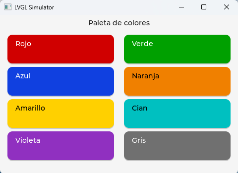

# BasicPlus

> 🇬🇧 [English version](README.md)

**Un lenguaje de propósito general para microcontroladores de 32 bits, con
sintaxis BASIC moderna, orientación a objetos, interfaz gráfica y un debugger
de primera clase.**

Compila a bytecode (`.mod`) que corre **idéntico** en el PC y en el micro:
el mismo programa que depuras en tu sobremesa parpadea después un LED en una
Raspberry Pi Pico 2, un ESP32-S3, un ESP32-P4 o un STM32 — sin recompilar, sin
`#ifdef`, sin sorpresas.

```basic
// blink.bp — parpadea el LED on-board de la Pico (GP25) con el API OO.
module Blink
  import Gpio

  function Main()
    var led: Gpio.Pin := Gpio.Pin(25, Gpio.Pin.OUTPUT)
    var i: integer := 0
    while i < 100 do
      led.on()
      sleep(300)
      led.off()
      sleep(300)
      i := i + 1
    endwh
    print "Blink terminado"
  end Main
end Blink
```

En un PC sin GPIO los builtins de hardware loggean por stdout; en la placa
mueven pines de verdad. El programa es el mismo byte a byte.

## Nuevo en V3 — interfaces gráficas

V3 añade **interfaces gráficas** sobre **LVGL**: una veintena de widgets, la
posibilidad de **diseñar las pantallas en un fichero JSON** que en tiempo de
ejecución se convierte en la ventana (con sus manejadores de eventos ya
conectados), y táctil — todo con el mismo "pinta en el PC, corre en la placa".
Verificado en tres pantallas: **STM32U5G9J-DK2** (LTDC), **ESP32-P4-Function-EV**
(EK79007) y una **Waveshare ESP32-P4** (ST7701).



*La demo `GuiColorDemo` — el mismo bytecode corre en el PC y en el micro.
Todo en la **[guía de interfaz gráfica](docs/gui.html)**.*

---

## El nombre (y una deuda de gratitud)

BasicPlus toma su nombre del **BASIC-PLUS de Digital Equipment Corporation**,
el dialecto estructurado de BASIC que corría bajo RSTS/E en los PDP-11 durante
los años 70 y 80. Aquel lenguaje demostró que un BASIC podía ser serio: con él
se escribieron sistemas completos, y con él aprendió a programar una
generación. Este proyecto es un homenaje a esa idea — **un lenguaje sencillo
de leer que no te trata como a un principiante** — trasplantada al hardware
pequeño de hoy: los microcontroladores de 32 bits.

## Qué incluye el lenguaje

- **Orientación a objetos completa**: clases con constructores, herencia
  (también entre módulos), `instanceof`, properties con `get`/`set`,
  properties `sync` (atómicas), miembros estáticos.
- **Tipos**: `integer`, `long` (i64), `float`, `double`, `boolean`, `string`
  (UTF-8 nativo, indexado por codepoints), tipos estrechos (`byte`, `word`,
  `short`, `int8`, `int16`), arrays (`integer[]`, `byte[]`, `long[]`, …) y
  arrays locales de tamaño fijo (`var buf: byte[64]`).
- **Tuplas** first-class (`(integer, string)`), **parámetros con valor por
  defecto**, expresiones multilínea, `switch/case`.
- **Excepciones**: `try/catch/finally`, jerarquía con base común `Exception`,
  `RuntimeError` nativo atrapable (división por cero, índices, red…),
  clases de excepción propias — también entre módulos.
- **Concurrencia**: threads BP sobre un scheduler de quanta, `Mutex`,
  `synchronized`, colas `SyncList` con consumo bloqueante.
- **Módulos** con interfaces compiladas (`.bpi`, modelo DEFINITION de
  Modula-2): `import` resuelve contra la interfaz, no contra el fuente.
- **`native function`**: funciones compiladas AOT a C/Thumb-2 (`.mdn`) que
  corren a velocidad nativa en RP2350/STM32 — 40-90× sobre el intérprete en
  kernels de cómputo, con faults propagados a `try/catch` BP.
- **Interfaz gráfica**: el módulo `Gui` sobre **LVGL** — ~20 widgets OO,
  formularios diseñados en JSON (`.win`), color y fuentes, táctil. El mismo
  bytecode pinta en una ventana del PC y en la pantalla de la placa.
- **Biblioteca estándar**: `Core`, `Math`, `IO` (ficheros + prompt), `Str`,
  `Collections`, `Stats`, `Compress` (LZSS), `Log`, `Json`, `Net` (cliente
  TCP) y el zoo de hardware: `Gpio`, `I2c`, `Spi`, `Uart`, `Pwm`, `Adc`,
  `Rtc`, `Wdt`, `Timer`, `Pulse`, `Neopixel`, `Pico`. Todo hardware nuevo
  es una clase (`Gpio.Pin`, `I2c.Bus`, `Net.Tcp`, …).

## Dos VMs gemelas, un invariante sagrado

El bytecode lo ejecutan **dos máquinas virtuales independientes**:

| VM | Lenguaje | Dónde corre |
|---|---|---|
| **miVM** | Java | PC (desarrollo, debugging, CI) |
| **bpgenvm-c** | C99 | PC (host) y los firmwares de los micros |

La regla de oro del proyecto: **la salida de un programa debe ser
byte-idéntica en ambas VMs**. Cada feature se verifica contra ese invariante
antes de entrar. Es lo que hace que "depura en el PC, despliega en el micro"
no sea un eslogan.

## Plataformas soportadas

| Plataforma | Transporte | Notas |
|---|---|---|
| PC (Windows/Linux/macOS) | — | Ambas VMs; daemon TCP para el IDE. La VM-C + LVGL/SDL pinta la GUI en una ventana. |
| Raspberry Pi **Pico 2** y Adafruit **Metro RP2350** | USB-CDC | **Una imagen de firmware única** para ambas placas: la variante (A/B), los pines y la PSRAM se deciden en *runtime* (`/sys/board.json`), no con macros de compilación. AOT activo. |
| **ESP32-S3** (Xtensa) | UART0 | FS persistente en partición dedicada; consola por USB nativo. |
| **ESP32-P4** (RISC-V) — con pantalla | UART | GUI con LVGL sobre panel MIPI-DSI + táctil. **Una imagen única** para el kit Function-EV (EK79007 1024×600) y la Waveshare 4.3" (ST7701 480×800); el panel se elige en *runtime* (`/sys/board.json`). |
| **STM32** (Nucleo-U575ZI-Q · Discovery U5G9J-DK2) | VCP del ST-LINK | FS en flash interna; AOT activo (mismo Cortex-M33 que el RP2350). El **Discovery DK2** añade pantalla LTDC (800×480) + táctil (GUI). |

En todas: REPL "wire v1" (JSON por línea) con subida de ficheros, RUN
remoto, **Stop** (KILL cooperativo sin resetear la placa), **autorun**
(`/sys/auto.txt` arranca tu programa al encender — dispositivo autónomo de
verdad, y el IDE puede conectarse en caliente y recuperar el control) y
debug on-device con breakpoints.

## Verificado en hardware real

No es solo teoría de sobremesa: la pila completa se ha ejercitado en silicio.
En una **Raspberry Pi Pico 2 / Pico 2 W** (RP2350) se ha validado de punta a
punta —desde el IDE, con *Run on Device* y el **mismo bytecode** que corre en
el PC— toda la escalera de hardware:

| Subsistema | Prueba en placa | |
|---|---|:--:|
| Ejecución / OO | clases stdlib cross-module despachando en el micro | ✅ |
| GPIO | LED parpadeando (`Gpio.Pin`) | ✅ |
| I2C | sensor real BMP280 (T/P) + escaneo de bus | ✅ |
| SPI | BME688 por SPI: `chip_id` + lecturas T/HR/P/gas con paginación de memoria | ✅ |
| UART | loopback, eco de bytes | ✅ |
| PWM + contador | 1 kHz / 500 Hz contados por hardware, < 0.1 % de error | ✅ |
| ADC | temperatura interna del chip (23.9 °C) | ✅ |
| RTC | reloj monotónico + recalibración | ✅ |
| Watchdog | feed / timeout / disable | ✅ |
| Timers | alarmas hardware (polling, sincronizado, cronómetro) | ✅ |

En el **STM32** (Nucleo-U575ZI-Q) se han validado además en placa, con sensores
reales, los **cuatro buses críticos**: GPIO, **SPI** (BME688), **UART** (loopback)
e **I2C** (BME280, T/P). Y en el **ESP32-S3** (DevKitC) se validaron en placa esos
**mismos cuatro buses** con sensores reales (BME688 por SPI, BME280 por I2C, loopbacks
de GPIO y UART) — las **tres familias no gráficas quedan a la par**. El **Metro
RP2350B** comparte la imagen de firmware con la Pico.

**V3 — las placas con pantalla.** La GUI (LVGL) se ha verificado en placa en las
tres: **STM32U5G9J-DK2** (LTDC 800×480 + táctil GT911), **ESP32-P4-Function-EV**
(EK79007 1024×600) y **Waveshare ESP32-P4** (ST7701 480×800) — catálogo de widgets,
color, formularios `.win` y táctil, con el mismo bytecode en las tres.

## El IDE

`BpIde` (Swing, un único jar): editor con pestañas, compilación con
diagnósticos, Run/Debug local y remoto, explorador de ficheros de la placa
con consola (`dir`, `run`, `kill`, `autorun`, `log`, …), INFO del micro,
breakpoints y paso a paso tanto en la VM local como dentro del dispositivo.

## Estructura del repositorio

```
lexer-java/   compilador (frontend): .bp → .mod + .bpi + .dbg (+ AOT .mdn)
miVM/         VM Java + debugger + daemon TCP
bpgenvm-c/    VM C99: host, firmware Pico/RP2350, ESP32-S3, ESP32-P4, STM32
BpIde/        IDE Swing (fat-jar)
bpstdlib/     biblioteca estándar (fuentes .bp + .mod compilados)
samples/      programas de ejemplo
docs/         manual, guía gráfica, specs (.mod, opcodes, heap, wire), backlog
```

## Compilar y probar (PC)

Requisitos: JDK 8+, Maven, GCC (MinGW en Windows), `make`.

```sh
# 1. Toolchain Java (compilador + VM Java)
mvn -f miVM/pom.xml install
mvn -f lexer-java/pom.xml install

# 2. VM C de host  (añade LVGL=1 para la ventana de la GUI; ver bpgenvm-c/README)
cd bpgenvm-c && make && cd ..

# 3. Compilar y ejecutar un ejemplo en AMBAS VMs
java -jar lexer-java/target/basicplus-frontend.jar samples/blink.bp \
     --compile samples --backend=mivm
java -jar miVM/target/bpgenvm-1.0.jar samples/Blink.mod
bpgenvm-c/build/bpgenvm-c samples/Blink.mod

# 4. (Opcional) el IDE
mvn -f BpIde/pom.xml package
java -jar BpIde/target/BpIde-3.0.jar
```

Los firmwares se compilan con sus toolchains habituales (pico-sdk + ninja,
ESP-IDF, STM32CubeIDE); ver `bpgenvm-c/{pico,esp32,esp32p4,stm32}/`. O coge
los **binarios precompilados** de la [última release](https://github.com/legio-e/BasicPlus/releases/latest).

## Documentación

- **[Inicio rápido](docs/QUICKSTART.md)** — de cero a blink, por plataforma.
- **[Instalar el firmware](docs/INSTALAR_FIRMWARE.md)** — flashear la VM en
  cada micro (imagen precompilada o compilada por ti).
- **[Manual del lenguaje](docs/manual.html)** — léxico, tipos, clases,
  módulos, excepciones, concurrencia.
- **[Referencia](docs/referencia.html)** — biblioteca estándar completa,
  línea de comandos y artefactos en disco.
- **[Guía de interfaz gráfica](docs/gui.html)** — el módulo `Gui`: widgets,
  color y fuentes, formularios (`.win`), ejecución en host y placa.
- **[Guía del IDE](docs/guia-ide.html)** — la ventana, proyectos, Run/Stop,
  el explorador de la placa, la consola del micro y el depurador.
- **[Basic Plus desde dentro](docs/bp-desde-dentro.html)** — la arquitectura:
  compilador, bytecode, las dos VMs, GC, AOT y firmwares.
- [Filosofía del proyecto](docs/PHILOSOPHY.md) — qué es y qué no quiere ser.
- Especificaciones: [formato .mod](docs/MOD_FORMAT.md),
  [opcodes](docs/OPCODES.md), [layout del heap](docs/HEAP_LAYOUT.md),
  [builtins](docs/BUILTINS.md), [protocolo wire](docs/BPVM_WIRE_PROTOCOL.md).
- [Backlog vivo](docs/PENDIENTES.md) — el diario honesto del proyecto.

## Estado

**V3 — interfaces gráficas** (julio 2026). La V1 demostró la idea; la V2 la
endureció y la amplió; **la V3 le pone cara**: un módulo `Gui` sobre LVGL,
pantallas diseñadas en JSON, y tres placas nuevas con pantalla (Discovery
STM32U5, ESP32-P4-EV, Waveshare ESP32-P4) — el mismo bytecode, ahora con
gráficos y táctil, verificado en hardware real.

Descargas (7 binarios precompilados) y detalle completo: la
**[release v3.0](https://github.com/legio-e/BasicPlus/releases/tag/v3.0)** y las
**[notas de versión](docs/RELEASES.md)**.

## Licencia

[MIT](LICENSE). Hecho con cariño, placas en la mesa y memoria de los
PDP-11.
